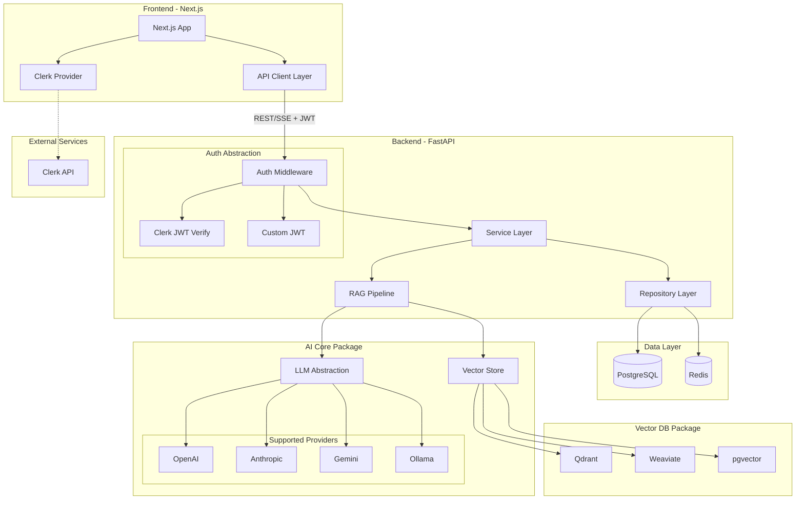
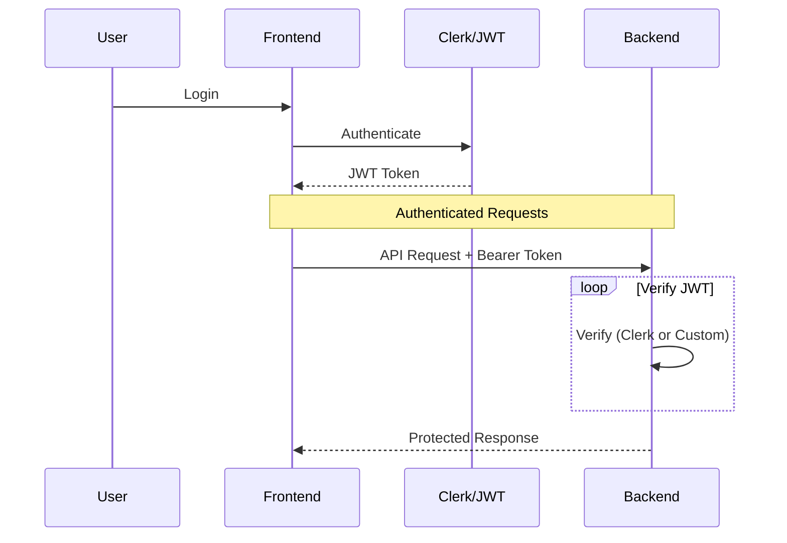
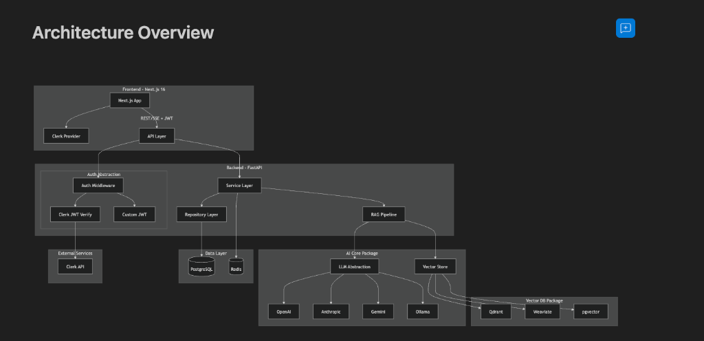
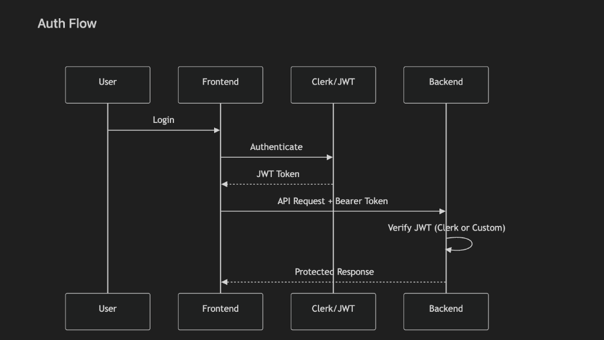

# Architecture Documentation - AI Stack

This document provides a deep dive into the technical architecture, design patterns, and data flows of the AI Stack project.

## 🗺 Architecture Overview

The system is composed of a Next.js frontend and a FastAPI backend, interacting through a secure REST/SSE API. The backend leverages modular packages for AI and Vector DB abstractions.



## 🔐 Auth Flow

The authentication flow supports both Clerk (primary) and a custom JWT fallback, ensuring no vendor lock-in.



### Reference Diagrams

For visual reference, here are the detailed architecture diagrams:

#### Architecture Overview


#### Auth Flow



## 📂 Project Structure

AI Stack is organized as a monorepo to maintain clear boundaries while sharing code efficiently.

### Backend Structure (`apps/backend/app`)

```text
apps/backend/app/
├── api/                  # REST endpoints (v1/)
│   └── v1/               # Versioned API routes
├── core/                 # App configuration & settings
│   ├── config.py         # Environment variables
│   └── security.py       # Security utilities
├── services/             # Business logic layer
│   ├── chat.py           # Chat orchestration
│   └── documents.py      # Document processing logic
├── repositories/         # Data access layer
│   ├── user.py           # User CRUD
│   └── base.py           # Base repository
├── models/               # SQLAlchemy database models
├── middleware/           # Auth, logging, CORS
├── tasks/                # Celery background tasks
├── ai/                   # AI logic (Agents, Chains)
├── vectorstore/          # Vector DB connection setup
├── auth/                 # Auth provider implementations
└── main.py               # Application entry point
```

### Frontend Structure (`apps/frontend`)

```text
apps/frontend/
├── app/                  # Next.js App Router
│   ├── (auth)/           # Authentication routes
│   ├── chat/             # Chat interface & logic
│   ├── documents/        # Document management pages
│   ├── api/              # API routes (e.g. webhooks)
│   ├── layout.tsx        # Root layout
│   └── page.tsx          # Landing page
├── components/           # React components
│   ├── ui/               # shadcn/ui primitives
│   └── ...               # Feature components
├── hooks/                # Custom React hooks
├── lib/                  # Utilities & libraries
│   ├── api.ts            # Typed API client
│   └── utils.ts          # Helper functions
├── public/               # Static assets
└── styles/               # Global styles (Tailwind)
```

## 🧩 Core Abstractions

### 1. LLM Client Factory (`packages/ai-core`)
The system uses a factory pattern to instantiate LLM clients based on environment configuration.
- **`LLMClient` (Base):** Abstract interface defining `complete`, `stream`, and `embed` methods.
- **Implementations:** `OpenAIClient`, `AnthropicClient`, `GeminiClient`, `OllamaClient`.

### 2. Vector DB Factory (`packages/vector-db`)
Similar to LLM clients, the vector database interaction is abstracted.
- **`VectorStore` (Base):** Defines `upsert`, `search`, and `delete` operations.
- **Adapters:** `QdrantStore`, `WeaviateStore`, `PgVectorStore`, `MilvusStore`.

### 3. RAG Pipeline (`packages/ai-core`)
A standard retrieval-augmented generation pipeline that orchestrates:
1.  **Embedding:** Question embedding via LLM Client.
2.  **Retrieval:** Searching the Vector Store for relevant chunks.
3.  **Reranking (Optional):** Refining results using a cross-encoder.
4.  **Completion:** Generating the final answer using the LLM with retrieved context.

## 🔐 Dual Authentication Strategy

AI Stack implements a robust, vendor-agnostic authentication strategy.

-   **Primary (Clerk):** For public-facing apps, Clerk provides a premium UI and comprehensive handle of user sessions.
-   **Fallback (Custom JWT):** A built-in JWT-based authentication system ensures you are never locked into a single provider.
-   **Abstraction Layer:** The `apps/backend/app/auth` logic uses an interface-based approach, allowing the backend to verify tokens from either provider seamlessly.

## 📦 Service-Repository Pattern

The backend follows the **Service-Repository** design pattern for clean separation of concerns:

-   **API Layer:** Handles HTTP requests, validation (Pydantic), and response formatting.
-   **Service Layer (`apps/backend/app/services`):** Encapsulates business logic, orchestrates AI flows, and handles complex operations.
-   **Repository Layer (`apps/backend/app/repositories`):** Directly interacts with the database (SQLAlchemy) for CRUD operations.

## 🔄 Data Flows

### RAG Query Flow
1.  **Request:** Frontend sends message to `/v1/chat`.
2.  **Auth:** Middleware verifies user (Clerk or JWT).
3.  **Service:** `ChatService` invokes the `RAGPipeline`.
4.  **Retrieve:** `RAGPipeline` gets embeddings, searches Qdrant.
5.  **Augment:** Context is injected into the prompt.
6.  **Respond:** Stream or final answer returned to frontend.

### Document Processing Flow
1.  **Upload:** User uploads file via `/v1/documents`.
2.  **Task:** Backend triggers an asynchronous Celery task.
3.  **Process:** Task chunks the document and generates embeddings.
4.  **Store:** Embeddings are upserted into the Vector Store; metadata is saved to PostgreSQL.

## 📊 Observability

-   **LLM Tracing:** Every LLM interaction is logged to **Langfuse** for performance monitoring and cost tracking.
-   **Metrics:** **Prometheus** scrapes API metrics (latency, error rates) and system resource usage.
-   **Logging:** Structured JSON logging for easy ingestion by ELK/Loki.
